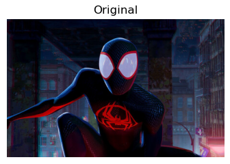
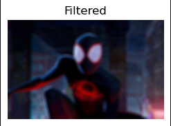
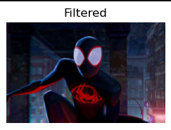
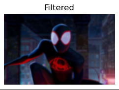
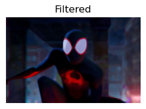
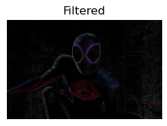
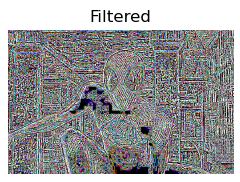

# IMPLEMENTATION-OF-FILTERSS
## Aim:
To implement filters for smoothing and sharpening the images in the spatial domain.

## Software Required:
Anaconda - Python 3.7

## Algorithm:
### Step1
Import the required modules.

### Step2
Convert the image from BGR to RGB.

### Step3
Apply the required filters for the image separately. 

### Step4
Plot the original and filtered image by using matplotlib.pyplot 

### Step5
End the program. 

## Program:
### Developed By   : Ronick Aakshath P
### Register Number: 212222240084
```
import cv2
import numpy as np
import matplotlib.pyplot as plt

image1 = cv2.imread('spiderman.jpg')
image2 = cv2.cvtColor(image1, cv2.COLOR_BGR2RGB)

plt.figure(figsize = (9, 9))
plt.subplot(1, 2, 1)
plt.imshow(image2)
plt.title('Original')
plt.axis('off')
```

### 1. Smoothing Filters

i) Using Averaging Filter
```
kernel = np.ones((11, 11), np.float32)/121
image3 = cv2.filter2D(image2, -1, kernel)
plt.subplot(1, 2, 2)
plt.imshow(image3)
plt.title('Filtered')
plt.axis('off')
```
ii) Using Weighted Averaging Filter
```
kernel2 = np.array([[1, 2, 1], [2, 4, 2], [1, 2, 1]])/16
image4 = cv2.filter2D(image2, -1, kernel2)
plt.subplot(1, 2, 2)
plt.imshow(image4)
plt.title('Filtered')
plt.axis('off')
```
iii) Using Gaussian Filter
```
gaussian_blur = cv2.GaussianBlur(src = image2, ksize = (11, 11), sigmaX = 0, sigmaY = 0)
plt.subplot(1, 2, 2)
plt.imshow(gaussian_blur)
plt.title('Filtered')
plt.axis('off')
```

iv) Using Median Filter
```
median = cv2.medianBlur(src = image2, ksize = 11)
plt.subplot(1, 2, 2)
plt.imshow(median)
plt.title('Filtered')
plt.axis('off')
```

### 2. Sharpening Filters
i) Using Laplacian Kernal
```
kernel3 = np.array([[0, 1, 0], [1, -4, 1], [0, 1, 0]])
image5 = cv2.filter2D(image2, -1, kernel3)
plt.subplot(1, 2, 2)
plt.imshow(image5)
plt.title('Filtered')
plt.axis('off')
```
ii) Using Laplacian Operator
```
new_image = cv2.Laplacian(image2, cv2.CV_64F)
plt.subplot(1, 2, 2)
plt.imshow(new_image)
plt.title('Filtered')
plt.axis('off')
```

## OUTPUT:
### Original Image

### 1. Smoothing Filters
</br>

i) Using Averaging Filter
</br>


ii) Using Weighted Averaging Filter
</br>


iii) Using Gaussian Filter
</br>


iv) Using Median Filter
</br>


### 2. Sharpening Filters
</br>

i) Using Laplacian Kernal
</br>


ii) Using Laplacian Operator
</br>


## Result:
Thus the filters are designed for smoothing and sharpening the images in the spatial domain.
